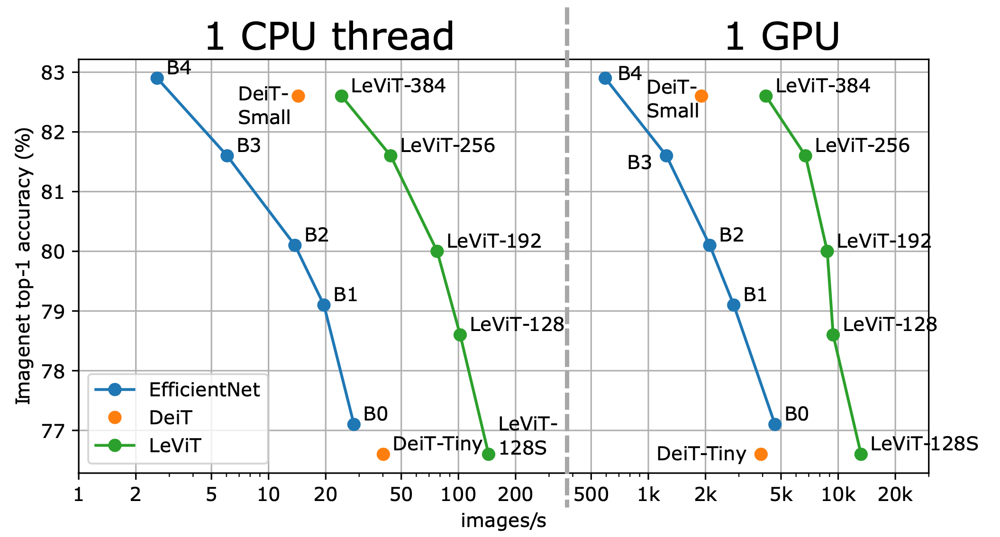

<<<<<<< HEAD
# LeViT: a Vision Transformer in ConvNet's Clothing for Faster Inference

This repository contains PyTorch evaluation code, training code and pretrained models for LeViT.

They obtain competitive tradeoffs in terms of speed / precision: 



For details see [LeViT: a Vision Transformer in ConvNet's Clothing for Faster Inference](https://arxiv.org/abs/2104.01136) by Benjamin Graham, Alaaeldin El-Nouby, Hugo Touvron, Pierre Stock, Armand Joulin, Hervé Jégou and Matthijs Douze.

If you use this code for a paper please cite:

```
@article{graham2021levit,
  title={LeViT: a Vision Transformer in ConvNet's Clothing for Faster Inference},
  author={Benjamin Graham and Alaaeldin El-Nouby and Hugo Touvron and Pierre Stock and Armand Joulin and Herv\'e J\'egou and Matthijs Douze},
  journal={arXiv preprint arXiv:22104.01136},
  year={2021}
}
```

# Model Zoo
  
We provide baseline LeViT  models trained with distllation on ImageNet 2012.
   

| name       | acc@1 | acc@5 | #FLOPs | #params | url                                                                   | 
| ---------- | ----- | ----- | ------ | ------- | --------------------------------------------------------------------- |
| LeViT-128S |  76.6 |  92.9 |   305M |    7.8M | [model](https://dl.fbaipublicfiles.com/LeViT/LeViT-128S-96703c44.pth) |
| LeViT-128  |  78.6 |  94.0 |   406M |    9.2M | [model](https://dl.fbaipublicfiles.com/LeViT/LeViT-128-b88c2750.pth)  |
| LeViT-192  |  80.0 |  94.7 |   658M |     11M | [model](https://dl.fbaipublicfiles.com/LeViT/LeViT-192-92712e41.pth)  |
| LeViT-256  |  81.6 |  95.4 |  1120M |     19M | [model](https://dl.fbaipublicfiles.com/LeViT/LeViT-256-13b5763e.pth)  |
| LeViT-384  |  82.6 |  96.0 |  2353M |     39M | [model](https://dl.fbaipublicfiles.com/LeViT/LeViT-384-9bdaf2e2.pth)  |


# Usage

First, clone the repository locally:
```
git clone https://github.com/facebookresearch/levit.git
```
Then, install PyTorch 1.7.0+ and torchvision 0.8.1+ and [pytorch-image-models](https://github.com/rwightman/pytorch-image-models):

```
conda install -c pytorch pytorch torchvision
pip install timm
```

## Data preparation

Download and extract ImageNet train and val images from http://image-net.org/.
The directory structure is the standard layout for the torchvision [`datasets.ImageFolder`](https://pytorch.org/docs/stable/torchvision/datasets.html#imagefolder), and the training and validation data is expected to be in the `train/` folder and `val` folder respectively:

```
/path/to/imagenet/
  train/
    class1/
      img1.jpeg
    class2/
      img2.jpeg
  val/
    class1/
      img3.jpeg
    class/2
      img4.jpeg
```

## Evaluation
To evaluate a pre-trained LeViT-256 model on ImageNet val with a single GPU run:
```
python main.py --eval --model LeViT_256 --data-path /path/to/imagenet
```
This should give
```
* Acc@1 81.636 Acc@5 95.424 loss 0.750
```


## Training
To train LeViT-256 on ImageNet with hard distillation on a single node with 8 gpus run:

```
python -m torch.distributed.launch --nproc_per_node=8 --use_env main.py --model LeViT_256 --data-path /path/to/imagenet --output_dir /path/to/save
```

### Multinode training

Distributed training is available via Slurm and [submitit](https://github.com/facebookincubator/submitit):

```
pip install submitit
```

To train LeViT-256 model on ImageNet on one node with 8 gpus:

```
python run_with_submitit.py --model LeViT_256 --data-path /path/to/imagenet
```

# License
This repository is released under the Apache 2.0 license as found in the [LICENSE](LICENSE) file.

# Contributing
We actively welcome your pull requests! Please see [CONTRIBUTING.md](.github/CONTRIBUTING.md) and [CODE_OF_CONDUCT.md](.github/CODE_OF_CONDUCT.md) for more info.
=======
# TinyTransformer
>>>>>>> c4cd47abeeafc15c1484bfa84b233e0065ec432c
